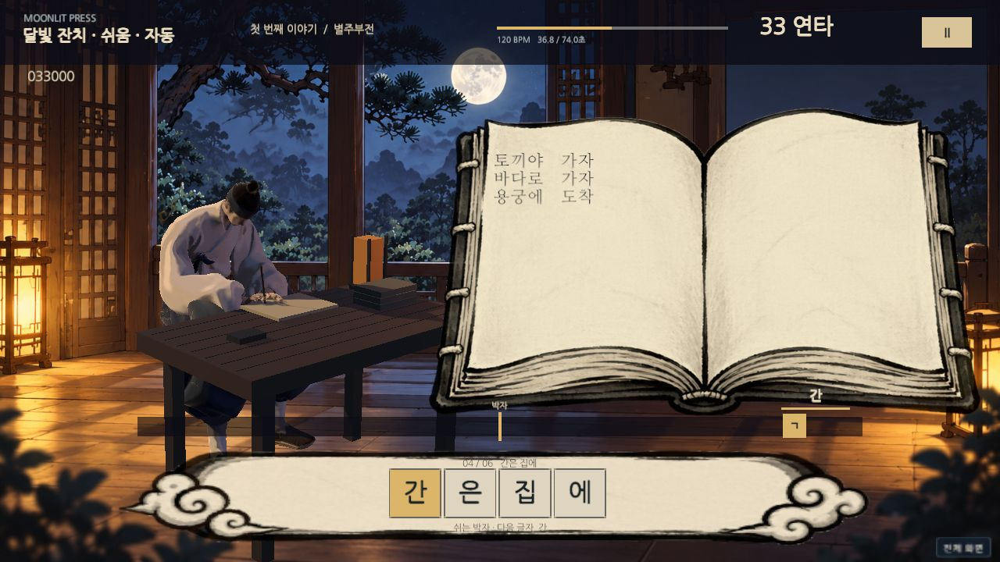
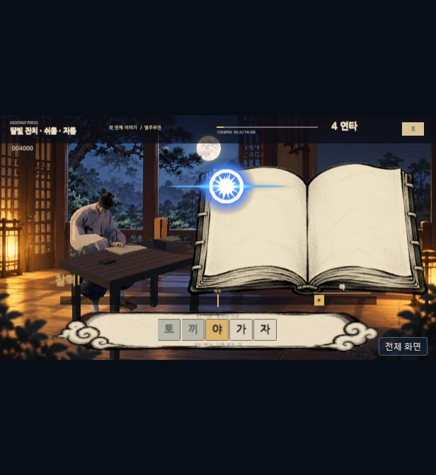

# 달빛 인쇄소 · Moonlit Press

달밤 서재에서 이야기를 쓰는 **Unity 6 리듬 타이핑 게임**. 왼쪽은 실제 3D 학자와 Mixamo 집필 동작, 오른쪽은 지금까지 쓴 글이 쌓이는 펼친 책, 아래는 두벌식 키 입력과 박자선입니다.

[웹에서 플레이](https://wwonnn.github.io/moonlit-typing/) · [GitHub 저장소](https://github.com/wwonnn/moonlit-typing)

## 플레이

- `집필 시작`: 두벌식 키보드의 물리 키를 박자선에 맞춰 누릅니다. 영문 입력 상태에서도 동작합니다.
- `ㄱ → ㅏ`는 `R → K`입니다. 각각 별도로 판정하고, `가`가 완성되어야 책으로 날아갑니다.
- 쌍자음·일부 모음은 Shift와 함께 입력합니다. 합성 모음과 겹받침은 구성 키를 차례대로 누릅니다.
- 화살표나 궤적선은 없습니다. 글자는 본문의 다음 칸에 본문 크기로 착지합니다.
- `ESC` 또는 `Ⅱ`: 일시정지, 판정 보정, 음량, 효과 강도 조절.
- `자동 연주 보기`: 전체 곡과 연출을 감상합니다. 최고 점수에는 기록하지 않습니다.
- 한 곡을 마치면 판정 점수가 책 판매량과 수입으로 이어집니다.



## 이번 플레이 빌드

- 기본 **튜토리얼: 달빛 잔치** — 기존 오리지널 곡 유지, 120 BPM, 74초, 28글자·67키. 곡의 멜로디 연주 이벤트를 따라 입력 시점을 선택합니다. 키 간격은 최소 0.5초이며, 글자 사이 최소 0.75초·문구 사이 최소 1.75초의 여유를 둡니다.
- **스테이지 1: 가장 빛나는 때** — 사용자 제공 원본 MP3, 약 2분 46초, 90글자·224키. 흥부전 이야기를 집필합니다. 실제 Unity 디코딩 오디오의 409개 소리 시작 후보에서 채보를 선택하며, BPM 약 140은 추정 메타데이터입니다. 최고 기록은 곡별로 저장합니다. 기존 도전곡과 합성 스크립트는 삭제했습니다.
- 실제 승인 Meshy 학자 메시와 텍스처, 수정된 Mixamo 애니메이션.
- 저채도 달밤 배경, 따뜻한 등불과 푸른 달빛, 카툰 명암 셰이더.
- 자모 키별 판정과 글자 단위 노트 묶음 표시. 기본 판정은 쉬움 ±100/180/240ms, 일반 스테이지 ±65/125/185ms이며, 촘촘한 구간에서는 인접 노드 중간 지점 안으로 허용창을 제한해 다음 키의 오판정을 방지합니다.
- Kenney Splat Pack 먹물 튐, 입력 글자 눌림·튀어오름, 가속하며 휘어지는 글자 비행. 착지 좌표·글꼴·크기는 본문과 일치합니다.
- 입력음은 Kenney Impact Sounds의 나무 타격 녹음, 착지는 중간 펀치, 문구 완성은 무거운 펀치 소리로 교체했습니다. 기존 합성 삑 소리는 플레이 중 사용하지 않습니다.
- 키 입력에 의한 카메라·모델·책상 흔들림 제거. 20콤보 단위로 다음 여유 구간에 SittingVictory 모션을 짧게 재생합니다.
- 브라우저 물리 키 이벤트 시각 보정, 반복 키다운 무시, 포커스 손실 시 자동 일시정지.
- 점수에 따른 판매 결과, 최고 기록 저장, 자동 연주 모드.

현재는 튜토리얼·새 스테이지 두 곡을 끝까지 플레이할 수 있는 프로토타입입니다. 다수의 책, 상점 경제, 장기 성장 시스템, 얼굴 표정 블렌드셰이프는 포함하지 않습니다.

## Unity

Unity **6000.0.74f1**, Built-in Render Pipeline, uGUI. `Assets/Scenes/MoonlitStudy.unity`를 열고 Play합니다. 실제 3D 무대와 UI는 런타임에 생성됩니다.

프로젝트 전체는 사용자가 지정한 로컬 `ChatGPT/리듬타이핑` 폴더에 있습니다. 공개 저장소에서는 원본 캐릭터 FBX·텍스처, Mixamo 독립 애니메이션 파일과 사용자 제공 원본 MP3을 제외합니다. 웹 빌드는 이 에셋을 게임에 통합한 형태입니다. 따라서 다른 컴퓨터에서 소스를 빌드하려면 사용 권한이 있는 승인 캐릭터 에셋을 먼저 가져와야 합니다.

```powershell
./Tools/Import-Scholar.ps1 -SourceDirectory "승인된 Scholar 에셋 폴더"
& "Unity.exe" -batchmode -nographics -projectPath "$PWD" -executeMethod BuildMoonlit.Prepare -quit -logFile prepare.log
& "Unity.exe" -batchmode -nographics -projectPath "$PWD" -buildTarget WebGL -executeMethod BuildMoonlit.BuildWeb -quit -logFile web-build.log
```

`SourceDirectory`에는 `Models/Scholar-Writing.fbx` 등 7개 FBX와 `Textures/BaseColor.png`, `Textures/Normal.png`가 있어야 합니다. 공개 저장소에서 재생 가능한 결과물은 `docs/`의 WebGL 빌드입니다. GitHub Pages는 `main` 브랜치 `/docs`를 사용합니다.

## 음악과 타격음

`Tools/compose_easy.py`는 튜토리얼 120 BPM 곡 **달빛 잔치**를 합성합니다. Python + NumPy를 사용하며 실제 악기 시작 시점을 `MoonlitFestival.json`에 저장합니다. 이 업데이트에서 튜토리얼 WAV와 전체 채보는 그대로 유지합니다.

**가장 빛나는 때**는 사용자가 제공한 스테레오 MP3를 그대로 임포트합니다. 로컬 프로젝트의 `Assets/Resources/Audio/ShiningMoment.mp3`에 있으며 공개 소스에는 원본을 포함하지 않습니다. 웹 빌드에서는 게임 배경음으로 재생합니다. `ImportStageAudio.ExportShiningMoment`가 Unity에서 디코딩한 PCM을 `.local/`에 내보내고 `Tools/analyze_song.py`로 소리 시작 후보와 템포를 분석합니다. 곡 정보는 `shining-music-report.json`에 기록합니다. 이야기 문구는 흥부전의 장면을 짧게 풀어쓴 문장이며 노래 가사를 전사하지 않았습니다. 게임 타격음은 `Audio/Impacts`의 Kenney 녹음입니다.

## 곡별 채보 생성

`SongChartGenerator`가 튜토리얼의 실제 악기 이벤트 또는 외부 곡의 소리 시작 후보 중 입력 시점을 선택합니다. BPM 반복 배치나 랜덤 패턴은 사용하지 않습니다. 한글의 물리 키 순서, 글자 내부 입력 간격, 글자·문구 사이 쉼, 완성 키의 강조점, 곡 전체 진행을 동적 계획법으로 함께 최적화합니다. 현재 쉬움은 10종의 키 간격과 25개 오프비트 입력을 포함합니다. 생성 결과는 `chart-report.json`, 세부 설계와 외부 음악 분석 방법은 [CHART_GENERATION.md](CHART_GENERATION.md)를 참고하세요. 기존 채보 최고 기록과 새 채보 최고 기록은 분리합니다.

## Cartoon FX

Cartoon FX Remaster Free 공식 패키지를 Unity 에디터의 My Assets에서 다운로드해 로컬 프로젝트에 임포트했습니다. `CFXR Hit A (Red)`, `CFXR Impact Glowing HDR (Blue)`, `CFXR Magic Poof`를 글자 착지와 콤보 연출에서 번갈아 사용합니다. 실제 파티클·재질·셰이더를 유지하고, 카메라 흔들림·파티클의 자동 삭제·광원 제어 스크립트는 게임 전용 프리팹에서 제거했습니다. 전용 투명 렌더 텍스처를 UI 위에 합성하며, 파티클 12개와 Kenney 스플랫 24개를 재사용합니다. ESC 일시정지는 두 효과도 함께 멈춥니다.



원본 패키지와 이를 복제한 프리팹은 공개 소스에서 제외합니다. 다른 컴퓨터에서는 [Cartoon FX Remaster Free](https://assetstore.unity.com/packages/vfx/particles/cartoon-fx-remaster-free-109565)를 본인 계정으로 가져온 후 `Moonlit > Prepare imported Cartoon FX`를 실행하세요. 배치 임포트는 Unity의 [`-importPackage`](https://docs.unity3d.com/6000.0/Documentation/Manual/EditorCommandLineArguments.html) 옵션을 사용합니다.

## 검증

`BuildMoonlit.Validate`는 한글 분해(겹받침·합성 모음·Shift 포함), 판정 경계, 채보 시간 순서, 곡 안에 채보가 들어가는지, 판매량 계산의 단조성, Humanoid Avatar를 검사합니다. 음악 이벤트와 모든 노드의 일치, 오디오 SHA-256, 입력/휴식 제약, 인접 판정창 비중첩, 동일 BPM에서 연주 시점 변경 시 채보 변화, 재생성 결정성도 검사합니다. 결과는 `validation.txt`에 기록됩니다. 브라우저 실제 플레이와 시각 확인 결과는 `QA.md`를 참고하세요.

## 출처

- 캐릭터: 사용자가 승인·제공한 Meshy 모델. 원본 에셋 권리는 해당 제공 조건을 따릅니다.
- 모션: Adobe Mixamo, 승인 모델로 내려받고 A/T pose 차이를 수정한 7개 모션.
- 배경·책 UI: 이 프로젝트를 위해 이미지 생성으로 제작. 확정 모델을 다시 생성하지 않았습니다.
- 글꼴: [Google Fonts 나눔고딕](https://github.com/google/fonts/tree/main/ofl/nanumgothic), [나눔명조](https://github.com/google/fonts/tree/main/ofl/nanummyeongjo), SIL OFL. 라이선스 파일은 `Assets/Resources/Fonts`에 포함합니다.
- 음악: 튜토리얼은 자체 합성 오리지널 「달빛 잔치」. 새 스테이지는 사용자 제공 「가장 빛나는 때」 MP3.
- Cartoon FX: Jean Moreno의 공식 무료 패키지. 원본 파일은 로컬 프로젝트에 보관하며 웹 빌드에서 게임 일부로 재생합니다.
- 먹물 튐: [Kenney Splat Pack](https://kenney.nl/assets/splat-pack), CC0.
- 입력·착지 타격음: [Kenney Impact Sounds](https://kenney.nl/assets/impact-sounds), CC0. 라이선스는 `Assets/ThirdParty/Kenney`에 포함합니다.

고정 배경 그림과 실제 3D 캐릭터·책상을 결합한 2.5D 무대입니다. 콘셉트 이미지를 그대로 게임 실행 화면으로 표시하는 방식은 아닙니다.
